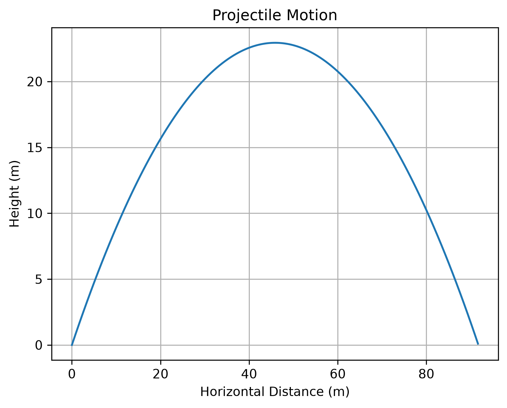
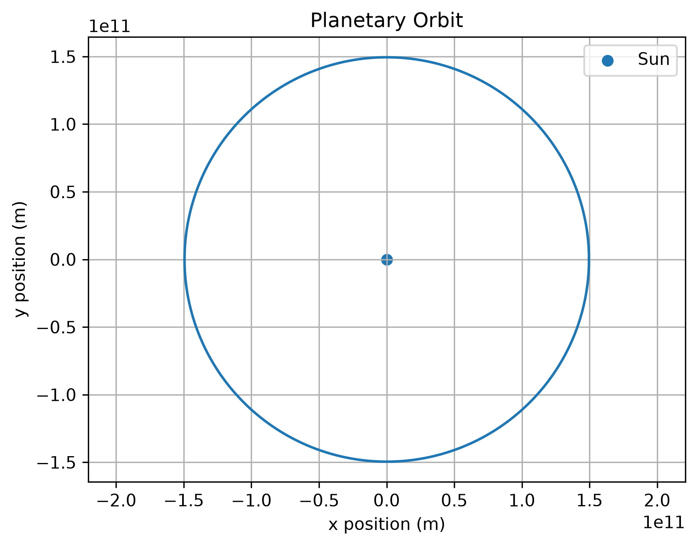

# PhysicsPy

**A Python toolkit for numerical methods and computational physics simulations.**

PhysicsPy is a scientific-computing project that connects applied mathematics, numerical analysis, and physics through implementations of numerical algorithms and physics simulations in Python.

The project currently includes root-finding algorithms, numerical differentiation and integration methods, projectile-motion modeling, and a two-dimensional planetary-orbit simulation. The implementations are supported by automated tests and visualization examples.

---

## Features

### Numerical Methods

#### Root Finding
- Bisection Method
- Newton–Raphson Method
- Secant Method

#### Numerical Differentiation
- Forward Difference
- Backward Difference
- Central Difference
- Forward Second Difference
- Backward Second Difference
- Central Second Difference

#### Numerical Integration
- Trapezoidal Rule
- Composite Trapezoidal Rule
- Simpson's 1/3 Rule
- Composite Simpson's 1/3 Rule
- Simpson's 3/8 Rule

### Physics Simulations

#### Projectile Motion

Simulates two-dimensional projectile motion under constant gravitational acceleration.

The module calculates:

- Projectile trajectory
- Maximum height
- Total flight time
- Horizontal range



#### Planetary Orbit

Simulates the motion of a planet around a central mass using Newtonian gravitational acceleration and numerical time stepping.

The Earth-like example uses an initial orbital radius and velocity to simulate approximately one year of motion around the Sun.



---

## Testing

PhysicsPy uses **pytest** for automated testing.

The current test suite contains **18 passing tests** covering:

- Root-finding algorithms
- Numerical differentiation
- Numerical integration
- Projectile motion
- Gravitational acceleration
- Orbital simulation

Run the complete test suite with:

```bash
pytest
```

---

## Installation

Clone the repository:

```bash
git clone https://github.com/teddybet/numerical-physics-toolkit.git
cd numerical-physics-toolkit
```

Create and activate a virtual environment:

```bash
python -m venv .venv
```

On Windows:

```bash
.venv\Scripts\activate
```

Install the project in editable mode:

```bash
pip install -e .
```

---

## Example

A projectile trajectory can be generated with:

```python
from physicspy.mechanics.projectile import (
    projectile_motion,
    projectile_statistics,
)

times, x, y = projectile_motion(
    initial_speed=30,
    angle_degrees=45,
)

max_height, flight_time, horizontal_range = projectile_statistics(
    initial_speed=30,
    angle_degrees=45,
)

print(f"Maximum height: {max_height:.2f} m")
print(f"Flight time: {flight_time:.2f} s")
print(f"Horizontal range: {horizontal_range:.2f} m")
```

Additional runnable examples are available in the `examples/` directory.

---

## Project Structure

```text
numerical-physics-toolkit/
├── examples/
│   ├── projectile_example.py
│   └── orbit_example.py
├── images/
│   ├── projectile_motion.png
│   └── orbit.png
├── src/
│   └── physicspy/
│       ├── mechanics/
│       │   ├── projectile.py
│       │   └── orbit.py
│       └── numerical_methods/
│           ├── bisection.py
│           ├── newton.py
│           ├── secant.py
│           ├── differentiation.py
│           └── integration.py
├── tests/
├── pyproject.toml
└── README.md
```

---

## Technologies

- Python
- NumPy
- Matplotlib
- pytest
- Git / GitHub

---

## Future Development

Planned extensions include:

- Euler and Runge–Kutta methods for differential equations
- Harmonic oscillator simulations
- Monte Carlo methods
- Relativity calculations
- Cosmological models
- Introductory quantum-mechanics simulations

---

## Motivation

PhysicsPy was developed as a learning and portfolio project to strengthen skills in numerical analysis, scientific computing, Python software development, and computational physics.

The project emphasizes implementing mathematical methods programmatically, validating them through automated tests, and applying them to physical systems that can be analyzed and visualized.