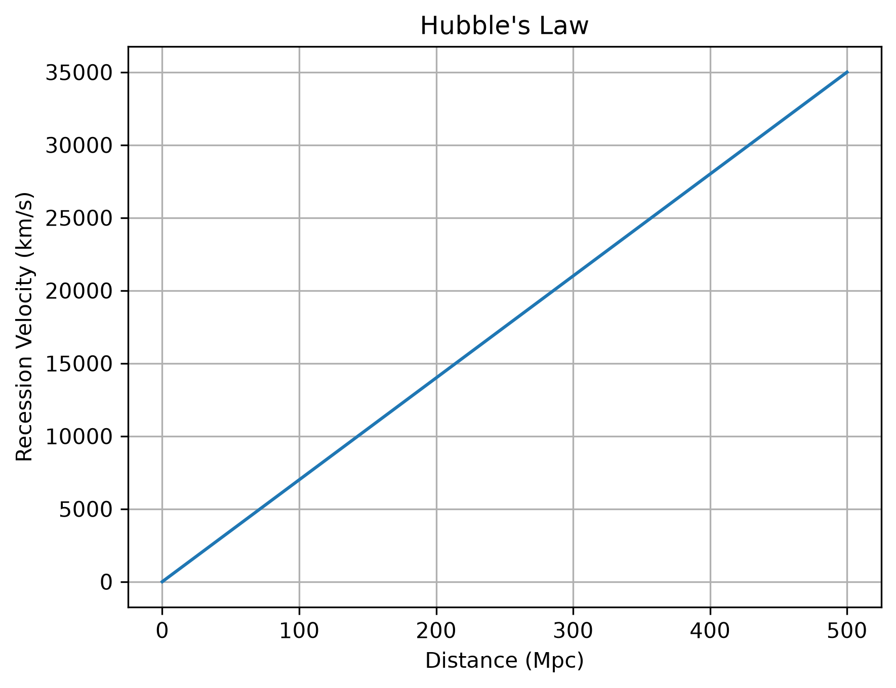
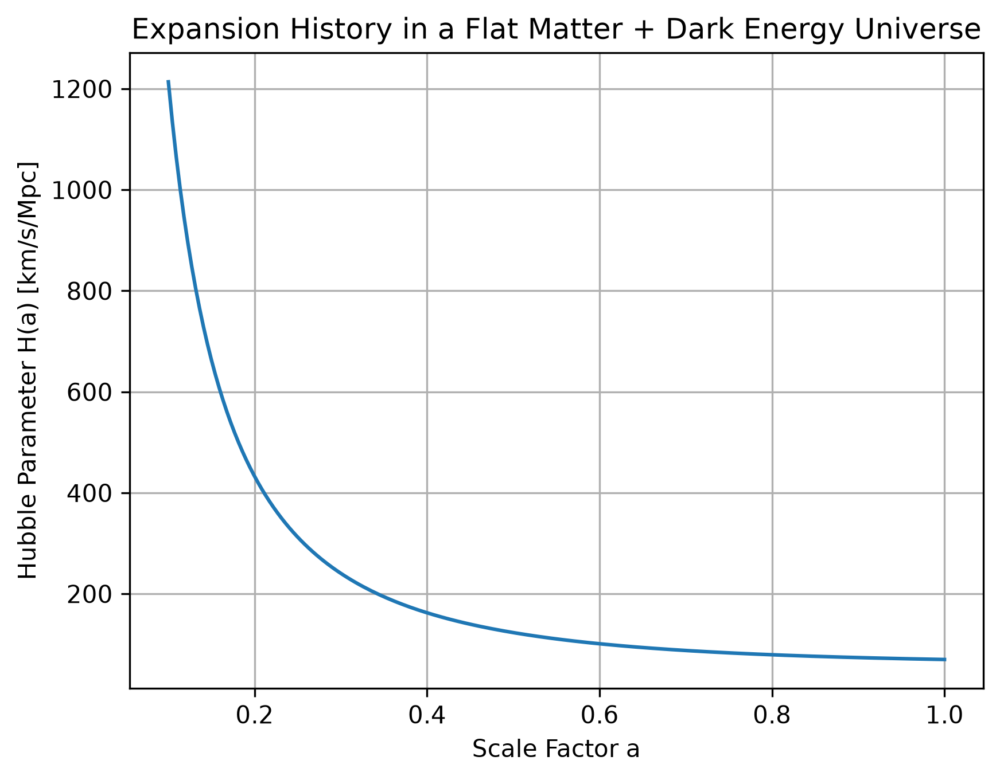
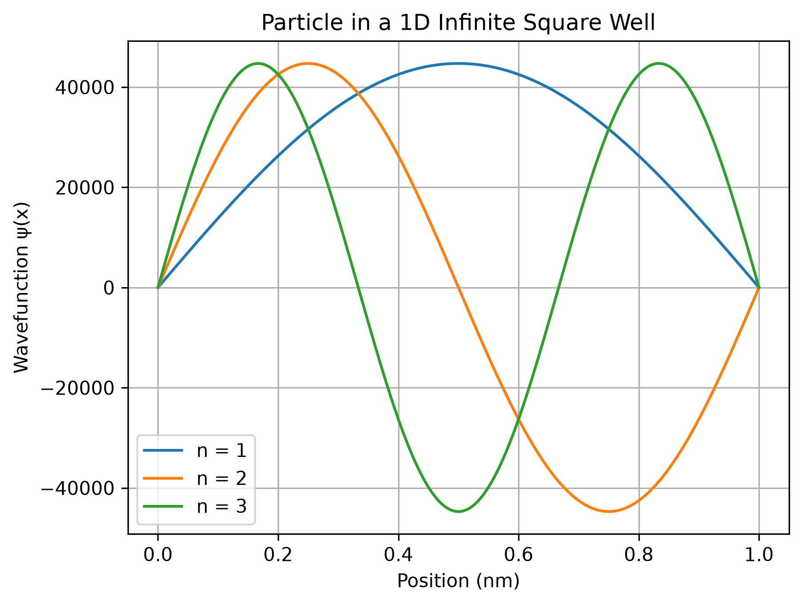
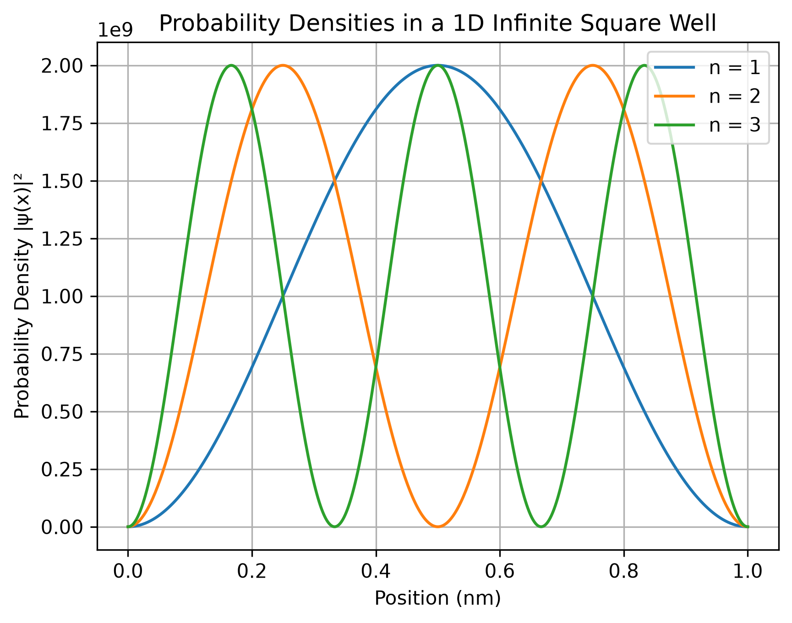

# PhysicsPy

**A Python toolkit for numerical methods and computational physics simulations.**

PhysicsPy is a scientific-computing project that connects applied mathematics, numerical analysis, and physics through implementations of numerical algorithms and computational models in Python.

The project currently includes root-finding algorithms, numerical differentiation and integration, classical mechanics simulations, orbital dynamics, cosmological calculations, and introductory quantum-mechanics models. The implementations are supported by automated tests and scientific visualizations.

---

## Features

### Numerical Methods

#### Root Finding
- Bisection Method
- Newton–Raphson Method
- Secant Method

#### Numerical Differentiation
- Forward Difference
- Backward Difference
- Central Difference
- Forward Second Difference
- Backward Second Difference
- Central Second Difference

#### Numerical Integration
- Trapezoidal Rule
- Composite Trapezoidal Rule
- Simpson's 1/3 Rule
- Composite Simpson's 1/3 Rule
- Simpson's 3/8 Rule

---

### Classical Mechanics

#### Projectile Motion

Simulates two-dimensional projectile motion under constant gravitational acceleration.

The module calculates:
- Projectile trajectory
- Maximum height
- Total flight time
- Horizontal range


#### Planetary Orbit

Simulates the motion of a planet around a central mass using Newtonian gravitational acceleration and numerical time stepping.

The Earth-like example uses an initial orbital radius and velocity to simulate approximately one year of motion around the Sun.


---

### Cosmology

PhysicsPy includes introductory computational models for studying the expansion of the universe.

#### Hubble's Law

Implements the relation

\[
v = H_0 d
\]

to calculate the recession velocity of a galaxy from its distance and a specified Hubble constant.



#### Cosmological Redshift

Calculates redshift from emitted and observed wavelengths using

\[
z = \frac{\lambda_{\mathrm{observed}}-\lambda_{\mathrm{emitted}}}
{\lambda_{\mathrm{emitted}}}.
\]

#### Expansion History

Implements a simplified flat matter + dark-energy cosmological model:

\[
H(a) =
H_0
\sqrt{
\frac{\Omega_m}{a^3}
+
\Omega_\Lambda
}
\]

to explore how the Hubble parameter changes with the cosmological scale factor.



---

### Quantum Mechanics

#### Particle in a 1D Infinite Square Well

Implements the normalized wavefunctions, probability densities, and quantized energy levels of a particle confined to a one-dimensional infinite potential well.

The wavefunctions are

\[
\psi_n(x)
=
\sqrt{\frac{2}{L}}
\sin\left(\frac{n\pi x}{L}\right),
\]

with quantized energies

\[
E_n =
\frac{n^2\pi^2\hbar^2}{2mL^2}.
\]

The examples visualize the first three quantum states and their corresponding probability densities.





---

## Testing

PhysicsPy uses **pytest** for automated testing.

The current test suite contains **33 passing tests** covering:

- Root-finding algorithms
- Numerical differentiation
- Numerical integration
- Projectile motion
- Gravitational acceleration and orbital simulation
- Hubble's law
- Cosmological redshift
- Cosmological expansion calculations
- Quantum wavefunctions
- Probability densities
- Quantized energy levels

Run the complete test suite with:

```bash
pytest
```

---

## Getting Started

Clone the repository:

```bash
git clone https://github.com/teddybet/numerical-physics-toolkit.git
cd numerical-physics-toolkit
```

Create a virtual environment:

```bash
python -m venv .venv
```

On Windows:

```bash
.venv\Scripts\activate
```

Install the project in editable mode:

```bash
pip install -e .
```

---

## Example

A projectile trajectory can be generated with:

```python
from physicspy.mechanics.projectile import (
    projectile_motion,
    projectile_statistics,
)

times, x, y = projectile_motion(
    initial_speed=30,
    angle_degrees=45,
)

max_height, flight_time, horizontal_range = projectile_statistics(
    initial_speed=30,
    angle_degrees=45,
)

print(f"Maximum height: {max_height:.2f} m")
print(f"Flight time: {flight_time:.2f} s")
print(f"Horizontal range: {horizontal_range:.2f} m")
```

Additional runnable examples are available in the `examples/` directory.

---

## Project Structure

```text
numerical-physics-toolkit/
├── examples/
│   ├── projectile_example.py
│   ├── orbit_example.py
│   ├── hubble_example.py
│   ├── expansion_example.py
│   ├── particle_in_box_example.py
│   └── particle_in_box_density.py
│
├── images/
│   ├── projectile_motion.png
│   ├── orbit.png
│   ├── hubble_law.png
│   ├── expansion_history.png
│   ├── particle_in_box_wavefunctions.png
│   └── particle_in_box_probability.png
│
├── src/
│   └── physicspy/
│       ├── numerical_methods/
│       │   ├── bisection.py
│       │   ├── newton.py
│       │   ├── secant.py
│       │   ├── differentiation.py
│       │   └── integration.py
│       │
│       ├── mechanics/
│       │   ├── projectile.py
│       │   └── orbit.py
│       │
│       ├── cosmology/
│       │   ├── hubble.py
│       │   ├── redshift.py
│       │   └── expansion.py
│       │
│       └── quantum/
│           └── particle_in_box.py
│
├── tests/
├── pyproject.toml
└── README.md
```

---

## Technologies

- Python
- NumPy
- Matplotlib
- pytest
- Git / GitHub

---

## Future Development

Planned extensions include:

- Euler and Runge–Kutta methods for differential equations
- Harmonic oscillator simulations
- Monte Carlo methods
- Relativity calculations
- More advanced orbital simulations
- Additional cosmological models
- Numerical solutions of the Schrödinger equation
- Quantum tunneling simulations

---

## Motivation

PhysicsPy was developed as a learning and portfolio project to strengthen skills in numerical analysis, scientific computing, Python software development, and computational physics.

The project emphasizes implementing mathematical methods programmatically, validating them through automated tests, and applying them to physical systems that can be analyzed and visualized.